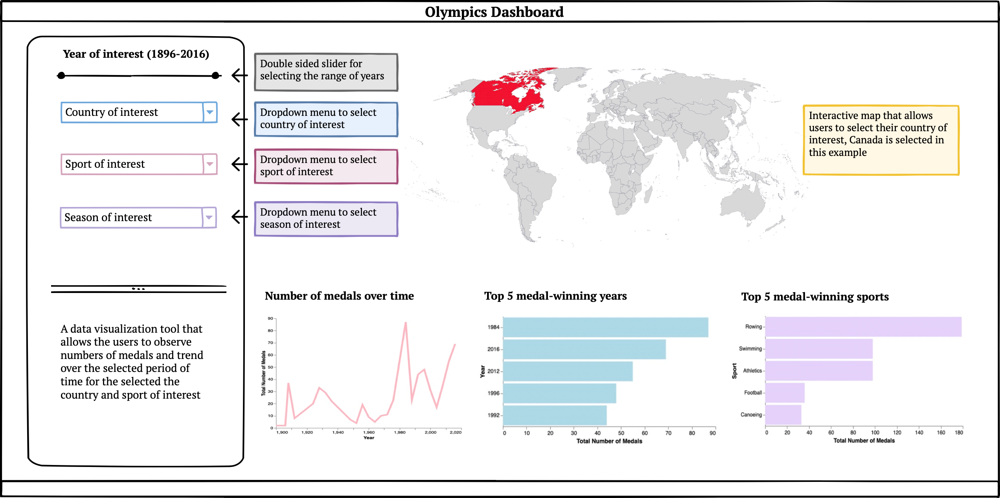

# OlymPulse

## Authors {#what-are-we-doing}

-   Raul Aguilar Lopez

-   Manvir Kohli

-   Crystal Geng

## Description of the Dashboard

This dashboard contains an interactive map of the world that includes each country's records of participation and historical data in the Olympics Games from Athens 1896 to Rio 2016. The interactive map allows the users to click into each country and view the country's records in both Summer and Winter Olympic Games.

In the side panel, there is a double-sided slider that allows the users to select the range of years they are interested in from 1896 to 2016. There are three dropdown menus which enable the users to select their country of interest (as an alternative way to using the interactive map), their sport of interest and their season of interest (Summer or Winter). With the options selected, the users can view the trend (a line chart) in the total number of medals over the given period of time and the top five medal-winning years (a bar chart). In particular, the dropdown menu for sport of interest allows the users to select either a particular sports or "all". If "all" is selected, the users will be able to view the top five sports in which the selected country won most medals during the selected period of time (a bar chart). Furthermore, the users can select either a particular season or "all" for the season of interest. If "all" is selected, the users will obtain the statistics for both seasons combined.

## Sample Sketch of the Dashboard

## Contributing

Interested in contributing? Check out the contributing guidelines. Please note that this project is released with a Code of Conduct. By contributing to this project, you agree to abide by its terms.

## License

`OlymPulse` was created by Raul Aguilar Lopez, Manvir Kohli and Crystal Geng. The materials of this project are licensed under the MIT License. If re-using/re-mixing please provide attribution and link to this webpage.
